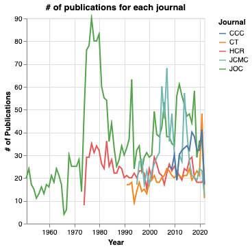
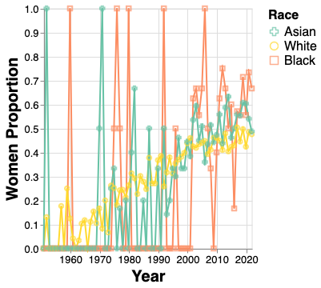
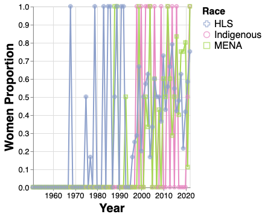

```{r setup, include=FALSE}
library(car)
library(olsrr)
library(stargazer)
library(bookdown)
```


# Interactive visualizations

Interactive visualizations showing the distribution of race and gender in different countries/regions are available at [https://icaviz.netlify.app/](https://icaviz.netlify.app/).

# Number of publications for each journal

See Figure \@ref(fig:numofpub).

```{r numofpub, echo=FALSE, fig.cap="Number of publications for each journal by year", out.width = '50%'}

```

# Women proportion among authors of different racial groups

See Figure \@ref(fig:wp1) and Figure \@ref(fig:wp2).


```{r wp1, echo=FALSE, fig.cap="Women proportion", out.width = '50%'}

```

```{r wp2, echo=FALSE, fig.cap="Women proportion", out.width = '50%'}

```


# Citation Analysis
## Read data

The first step is to read data:

```{r read data}
df <- read.csv("../data/processed/papers_to_study_expanded.csv")
df$Year.Distance.from.2022 = abs(df$year - 2022)

# do the log10 transformation on citation counts
df$gscholar_citation_log10 <- log10(df$gscholar_citation + 0.1)
var_cols <- c(1, 16:17, 20:33, 35:36)
data <- df[, var_cols]
```

## Deal with univariate outliers

```{r}
hist(data$gscholar_citation_log10)
data$gscholar_citation_log10_stdized <- scale(
  data$gscholar_citation_log10,
  center = T,
  scale = T
)
data$outlier0 <- ifelse(data$gscholar_citation_log10_stdized > 3.3 | 
                          data$gscholar_citation_log10_stdized < -3.3,
                        1, 0
)
table(data$outlier0)
```

As can be seen, there are 103 outliers. 

## Build model

```{r}
# '10.1111/j.1460-2466.1977.tb02133.x', '10.1111/j.1460-2466.1952.tb00171.x' These two papers have no gscholar data, and they will be excluded in the following line because its outerlier0 is N/A, not 0. 
datanew <- subset(data, outlier0 == 0)
datanew$outlier0 <- NULL
datanew$gscholar_citation_log10_stdized <- NULL

model <- lm(gscholar_citation_log10~., datanew)
```

## Dianostics

```{r}
## Normality
ols_plot_resid_qq(model)

#Correlation between observed residuals and expected residuals under normality.
ols_test_correlation(model)

ols_plot_resid_hist(model)

## linearity & homoscedasticity 
ols_plot_resid_fit(model)

## collinearity diagnostics
# ols_coll_diag(model)
vif(model)
```

## Run Model

```{r}
summary(model)
```
